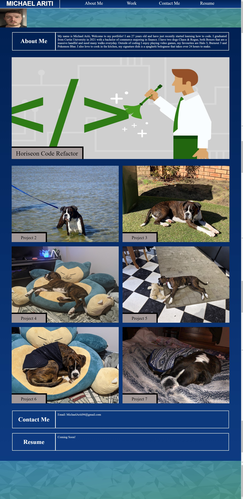

# Homework Week 2 Portfolio Michael Ariti

## Portfolio

The purpose of this repository is to create a basic portfolio that will be expanded on in the future. The portfolio is for the author showing off multiple projects, at the moment however there is only one live project, so several have placeholder images and will just re-link to the portfolio itself.

## File Directory

You will find the index.html next to this readme, which is the finished website code.

In the assets folder you will find 
1. The guidelines to this homework
2. The css style sheet for the index.html
3. The screenshot of the finished website which is pictured below, and all the images used in the webpage.

## Secreenshot

## Webpage URL
[Portfolio-URL](https://michaelfellas.github.io/Portfolio/)

## References

Image: Code-Refactor.jpg; was taken from https://res.cloudinary.com/practicaldev/image/fetch/s--L-1erqyX--/c_imagga_scale,f_auto,fl_progressive,h_900,q_auto,w_1600/https://dev-to-uploads.s3.amazonaws.com/uploads/articles/k1v5w8l72wy9a7paxowp.png

Image: header-1.jpg; was taken from https://www.appmachine.com/no-branding-header-background/

### End

Michael Ariti 2021

